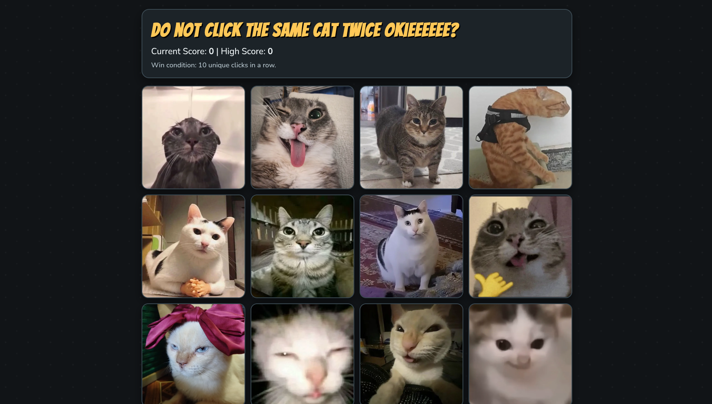

# Memory Card Game

This is a web-based memory game built with React + Vite for people who enjoy tiny victories, dramatic short-term-memory losses, and matching their favorite cat memes from across the internet.

## Screenshot

## Features

- Card-matching gameplay with a clean game board
- Score tracking so your ego can be measured in real time
- Modal feedback for game events
- Sounds, gifs, and visual flair because plain is pain

## Tech Stack

- React
- Vite
- ESLint
- Vitest